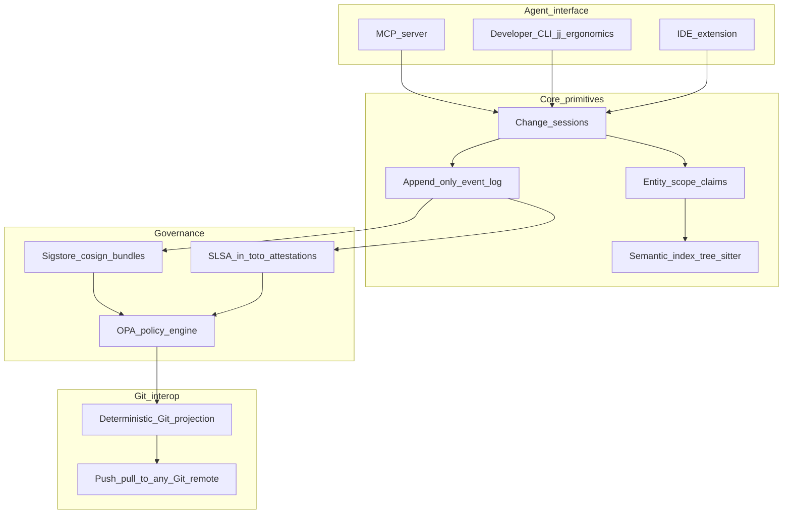
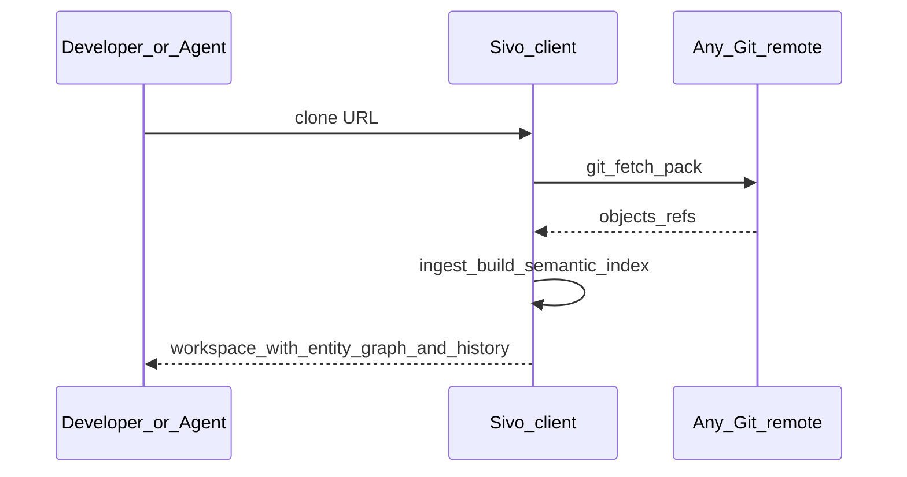

# AI-centric SCM (v4): Sivo-integrated options, protocol, and recommendation

---

## 1. Strategic positioning (confirmed)

- **Primary buyer**: developers (OSS adoption, DX).
- **Ultimate buyer**: enterprises (governance, audit, supply chain).
- **License**: open-source core; monetize hosted control plane, SSO, policy packs, SLA.
- **Claim**: a novel Git **alternative** --- not wrapper --- for AI-native SDLC; **interoperable** with GitHub, GitLab, Bitbucket via lossless Git projection.
- **MVP scope**: host-agnostic Git wire (clone/fetch/push to any remote); no host-specific app in v0.

### Sivo integration (canonical naming inside this same plan)

- **Sivo is not a separate plan**: it is the operating protocol and product layer of this AI-centric SCM vision.
- **Canonical product/protocol name**: **Sivo**.
- **Conceptual framing**: **Sivo Lineage** for multi-modal history (code/chat/voice/artifacts).
- **Protocol surface**: Sivo-native operations are exposed through MCP and CLI, then projected deterministically to Git for interoperability.
- **Adoption stance**: AI agents can auto-use Sivo through MCP; developers can use CLI/IDE directly or indirectly via agents.

### Plan context object (used across all flows)

Every coordinated session carries a structured `plan_context` to keep human intent and agent execution aligned:

- `intent`: problem statement, user goal, non-goals.
- `scope`: repos, modules, symbols, modalities (code/chat/voice/docs).
- `constraints`: policy, compliance, runtime, rollout safety constraints.
- `compatibility_target`: Git interop profile and external system expectations.
- `evolution_policy`: compatibility guarantees, deprecation windows, fallback rules.
- `success_criteria`: functional, DX, governance, and reliability outcomes.

---

## 2. Industry trends that reshape the plan (March 2026 grounding)

### Trend A --- Multi-agent is the new default

- 72% of enterprise AI projects involve multi-agent architectures (up from 23% in 2024).
- Every major AI coding platform shipped multi-agent capabilities in Feb 2026 (Claude Code agent teams, Cursor cloud agents, Devin 2.0, GitHub Agent HQ, Grok Build).
- **CooperBench** (Jan 2026) found agents achieve ~50% lower success rates when collaborating vs solo --- the bottleneck is coordination, not intelligence.
- Fragmented solutions are appearing: **Clash** (worktree conflict detection), **agent-comms** (file-based coordination protocol), **Weave** (entity-level CRDT claims + semantic merge via tree-sitter, with MCP server).

**Implication for SCM**: multi-agent coordination (workspace claims, conflict-free zones, entity-level locks) should be a **first-class primitive inside the SCM**, not bolted on. This is the single largest unmet need and the strongest "why not just use git" answer.

### Trend B --- MCP as universal agent interface

- Model Context Protocol is now the Linux Foundation-stewarded standard for AI agent tool use.
- Supported natively by Claude, GPT, Gemini, Cursor, Windsurf and all major agent platforms.
- **Weave** already exposes coordination primitives via MCP server.

**Implication for SCM**: exposing SCM operations (clone, claim, query, seal, push, policy check) as an **MCP server** makes the SCM instantly accessible to every agent platform --- a massive adoption lever that no existing VCS offers.

### Trend C --- Jujutsu (jj) proves appetite but leaves gaps

- jj has high retention ("once you spend a week, you never go back") and works alongside Git invisibly.
- Validates that developers **want** a better revision model and will adopt if migration is low-friction.
- **But** jj does not address: provenance, multi-agent coordination, governance/attestations, or semantic merging. It is ergonomics on Git, not a new paradigm.

**Implication for SCM**: jj is a peer/inspiration for revision ergonomics, not a competitor for the full AI-centric story. Borrow its UX lessons (auto-rebase, operation log, no staging area) but go further.

### Trend D --- Platform engineering and IDP adoption

- 80% of software engineering orgs now maintain dedicated platform teams.
- Platforms reduce developer cognitive load by 40-50% via self-service, golden paths, and policy-as-code.
- Policy-as-code (OPA) at merge gates is moving from Kubernetes to SDLC workflows.

**Implication for SCM**: position the SCM as a **platform component** that plugs into service catalogs and golden paths. Policy engine integration is table stakes for enterprise, not a premium.

### Trend E --- Supply chain and governance hardening

- Sigstore/cosign bundles, SLSA build provenance, in-toto attestations are becoming **mandatory** (EU CRA, US federal norms).
- New "Agent Access Security Broker" (AASB) category emerging for governing coding agents.
- EU AI Act requires: prompt/model logging, human review records, reasoning audit trails.

**Implication for SCM**: the SCM is the natural place to **originate** governance evidence --- not just pass it through. Agent session seals, policy decisions, and human approvals as signed, immutable events become a compliance differentiator.

---

## 3. Critical challenges (sharpened)

**For developers**: review fatigue on AI-generated PRs; merge conflict hell with concurrent agents; no way to replay/undo an agent's session atomically; Git's mental model (staging, rebase, detached HEAD) fights AI workflows.

**For AI agents**: no standard way to claim work scope before editing; expensive full-repo reads; merge conflicts discovered late; no structured way to record "why I made this change."

**For enterprises**: no tamper-evident chain from prompt to production; no separation of agent vs human approval authority; audit exports are ad-hoc; policy enforcement is duct-taped to CI scripts.

**For multi-agent teams (new, critical)**: 50% success rate drop when agents collaborate; fragmented coordination tools (Clash, agent-comms, Weave) prove the need but are bolted onto Git, not built into the revision model.

---

## 4. Competitive landscape (what exists, what is missing)

- **Jujutsu (jj)**: better Git UX, proven adoption. Missing: provenance, multi-agent, governance, semantic merge.
- **Entire.io**: "shadow branches" + checkpoints for agent reasoning. Missing: open-source, multi-agent coordination, policy gates, MCP.
- **Kin**: semantic entity graph VCS, strong benchmarks. Missing: Git interop maturity, enterprise governance, MCP.
- **Aura**: AST-level tracking, architectural deviation blocking. Missing: adoption, Git bridge, multi-agent.
- **Weave**: entity-level CRDT merge + MCP server. Missing: full VCS, provenance, governance.
- **Clash / agent-comms**: worktree conflict detection / file-based coordination. Missing: everything except the coordination problem.

**Gap no one fills end-to-end**: a single system that combines (a) new revision model, (b) Git interop, (c) multi-agent coordination as core primitive, (d) MCP-native interface, (e) provenance + attestations, (f) policy gates. This is the opportunity.

---

## 5. Recommended options (with key value)

### Option Alpha --- "Sivo coordination-first SCM" (RECOMMENDED)

**Core idea**: Sivo's defining primitive is the **coordinated change session** --- not the file diff. Multiple agents and humans claim scopes (entities, files, modules), work in isolated contexts, and merge via **semantic (entity-level) resolution**. Everything is recorded in an append-only event log, projected losslessly to Git.

**Key value**:

- **For developers**: "git but it understands my code" --- semantic diffs, atomic session undo, auto-conflict prevention, no staging area, jj-style ergonomics.
- **For AI agents**: Sivo MCP server interface to claim scope, query semantic graph, apply structured deltas, and seal sessions --- works with every major model/agent platform instantly.
- **For multi-agent teams**: built-in coordination eliminates the 50% collaboration penalty. Entity-level claims + CRDT-safe zones + conflict matrix before any edit happens.
- **For enterprises**: every session seal is a signed bundle with provenance (prompt hash, model ID, tool versions, policy decisions, human approvals). SLSA/Sigstore-aligned. Exportable audit archives. OPA-compatible merge gates.
- **Git interop**: lossless, deterministic projection from Sivo sessions to Git commits/trees. Push/pull to GitHub/GitLab/Bitbucket. Teams adopt incrementally; non-adopters see normal Git.

**Risk**: highest engineering complexity (semantic merge + coordination + Git bridge). Mitigate by shipping coordination + Git bridge first, semantic merge as progressive enhancement.

**2-3 year defensibility**: multi-agent coordination as a built-in primitive is structurally hard to retrofit onto Git. MCP-native interface creates network effects as agents adopt. Governance trail becomes compliance moat.




---

### Option Beta --- "Governance overlay on jj" (FASTER TO SHIP)

**Core idea**: fork or extend **Jujutsu (jj)** with a provenance layer (session traces, attestations, policy decisions) and an MCP server. Rely on jj's existing Git interop and revision ergonomics. Add multi-agent coordination as a layer on top of jj's operation log.

**Key value**:

- **For developers**: jj's proven UX (auto-rebase, operation log, no staging) plus provenance metadata and semantic diff views.
- **For AI agents**: MCP server for structured access to jj operations + provenance recording.
- **For enterprises**: signed session bundles, OPA gates, SLSA attestations layered onto jj commits.
- **Git interop**: inherited from jj --- battle-tested, same `.git` directory.

**Risk**: jj is Rust, Google-originated, with its own governance and roadmap. Forking creates maintenance burden; extending upstream depends on jj maintainers accepting provenance/MCP features. Multi-agent coordination is constrained by jj's file-level model --- no native entity claims.

**2-3 year defensibility**: weaker. If jj itself adds provenance or MCP, your overlay becomes redundant. No structural moat on coordination.

---

### Option Gamma --- "Enterprise attestation plane" (FASTEST REVENUE)

**Core idea**: build a standalone **signed provenance + policy + attestation service** that integrates with Git, jj, or any VCS via hooks and CI plugins. Not a VCS itself --- a governance layer.

**Key value**:

- **For enterprises**: immediate compliance value. Capture agent sessions, model IDs, policy decisions, human approvals as signed records. Export audit bundles. OPA merge gates.
- **For developers**: minimal workflow change --- add a CLI/hook that records provenance alongside normal Git commits.
- **Git interop**: not applicable --- works on top of any VCS.

**Risk**: does not win "Git alternative" positioning. Competes with emerging AASB vendors (Unbound AI, Harness AI governance). No developer adoption flywheel.

**2-3 year defensibility**: low as a standalone product. High as a **component** inside Option Alpha.

---

## 6. Critical flows (expanded for recommended Sivo Option Alpha)

### Flow 1 --- Multi-agent coordinated Sivo session (NEW, defining flow)

```mermaid
sequenceDiagram
  participant Orch as Agent_orchestrator
  participant A1 as Agent_1_backend
  participant A2 as Agent_2_tests
  participant SCM as Sivo_MCP_server
  participant Log as Event_log

  Orch->>SCM: create_session plan_context_v1
  SCM-->>Orch: session_id

  Orch->>SCM: claim_scope session_id agent_1 entities:auth_module
  SCM-->>Orch: claim_granted no_conflicts
  Orch->>SCM: claim_scope session_id agent_2 entities:auth_tests
  SCM-->>Orch: claim_granted no_conflicts

  A1->>SCM: apply_delta session_id structured_patch
  A2->>SCM: apply_delta session_id structured_patch

  SCM->>SCM: semantic_merge entity_level
  SCM->>Log: seal_session sivo_bundle_v1

  Note over SCM,Log: Conflict matrix checked continuously; claims prevent overlap before edits
```


### Flow 2 --- Bootstrap and Sivo Git interop




### Flow 3 --- Single Sivo session (solo developer path)

```mermaid
flowchart LR
  subgraph session [Agent_or_human_session]
    Edit[Edit_via_CLI_IDE_or_MCP]
    Checkpoint[Auto_checkpoint_every_N_seconds]
    Verify[Run_tests_scanners_locally]
  end
  subgraph seal [Seal_and_attest]
    Bundle[Signed_change_bundle]
    Provenance[Prompt_model_tool_trace]
    PolicyCheck[OPA_policy_evaluation]
  end
  subgraph publish [Publish]
    GitProj[Deterministic_Git_projection]
    Push[git_push_to_remote]
  end
  Edit --> Checkpoint
  Checkpoint --> Verify
  Verify --> Bundle
  Bundle --> Provenance
  Provenance --> PolicyCheck
  PolicyCheck --> GitProj
  GitProj --> Push
```




### Flow 4 --- Enterprise merge gate with Sivo attestations

```mermaid
sequenceDiagram
  participant PR as Pull_request_on_host
  participant CI as CI_pipeline
  participant Pol as OPA_policy_engine
  participant SCM as Sivo_control_plane

  PR->>CI: trigger_pipeline
  CI->>CI: build_test_scan
  CI-->>SCM: signed_SLSA_attestations
  SCM->>SCM: verify_session_provenance
  SCM->>Pol: evaluate_merge_policy
  Pol-->>PR: verdict_allow_or_deny_with_reasons
  Note over PR,SCM: Human approval is a separate signed event; agents cannot forge it
```


### Flow 5 --- Audit and regulatory export

- Export a **single verifiable archive**: event log slice + hybrid classical/PQ signatures + linked Git SHAs + CI attestations + model/tool identifiers + policy decisions.
- **Replay** reconstructs workspace state, policy context, and the exact agent session --- not just `git checkout`.
- Satisfies EU AI Act requirements: prompt/model logging, human review records, reasoning trails.

---

## 7. Security and governance primitives

- **Immutable event log**: append-only, Merkle-linked segments. No silent rewrites. Compaction via new epochs.
- **Signing**: Sigstore/cosign keyless bundles (OIDC identity) with hybrid classical + post-quantum signature profiles for session seals, merge approvals, and policy overrides.
- **Separation of duties**: human approval is a distinct signed event type; agent identity keys cannot mint approval attestations.
- **Entity-level claims**: prevent concurrent modification conflicts at the semantic level, not just file locks.
- **Scanner integration**: secret detection, license scanning, and SAST results are **signed attestation inputs** to merge policy --- not optional hooks.
- **Deterministic projection**: Git tree output is a pure function of the sealed bundle. Verified by determinism tests on every seal. Enterprises will not accept "two truths" that can diverge.

---

## 8. Option comparison matrix

**Dimension** / **Option Alpha** / **Option Beta** / **Option Gamma**

- **"Git alternative" positioning**: Strong / Weak (jj is the brand) / None
- **Multi-agent coordination**: Built-in / Bolted-on / N/A
- **MCP-native interface**: Yes, core / Yes, added / Possible but orthogonal
- **Semantic merge**: Entity-level / File-level (jj) / N/A
- **Git interop**: Lossless projection / Inherited from jj / Works with any VCS
- **Governance and attestations**: First-class / Added layer / Core (only offering)
- **Developer adoption speed**: Medium (new tool to learn) / Fast (jj already proven) / Slow (no DX story)
- **Enterprise revenue path**: Strong (governance + platform) / Medium (governance add-on) / Fast but narrow
- **Engineering complexity**: High / Medium / Low
- **2-3 year defensibility**: High (structural moat) / Low (jj can absorb) / Low (AASB competition)
- **Time to MVP**: ~6-9 months / ~3-4 months / ~2-3 months

---

## 9. Recommendation and phased strategy

**Lead with Option Alpha** --- but ship it in phases that let you capture value early:

### Phase 0 (months 0-3): "Sivo core + Git bridge + coordination CLI"

- Append-only event log + deterministic Git projection (clone/fetch/push).
- Sivo MCP server with: `create_session`, `claim_scope`, `apply_delta`, `seal`, `push`.
- `plan_context_v1` contract (machine-readable + human-readable summary) required on every session.
- Entity-level conflict matrix (tree-sitter-based, inspired by Clash/Weave).
- CLI with jj-style ergonomics (no staging, auto-checkpoint, operation log).
- **Value delivered**: multi-agent coordination that works today, pushes to any Git remote.

### Phase 1 (months 3-6): "Sivo provenance and governance"

- Signed session bundles (Sigstore/cosign).
- Provenance recording (prompt hash, model ID, tool versions, retrieved context hashes).
- OPA-compatible policy evaluation at seal time.
- Attestation export (SLSA-shaped predicates for CI, custom predicates for agent sessions).
- Multi-model execution profile (provider/model neutrality, deterministic event schema regardless of model backend).
- **Value delivered**: enterprise audit trail, compliance readiness.

### Phase 2 (months 6-12): "Sivo semantic layer and review"

- Semantic diff and merge (entity-level, tree-sitter, 20+ languages).
- Semantic code search tied to revision history ("what changed this API across versions").
- Review UI: symbol-level summaries with line-diff fallback.
- IDE extension (VS Code / Cursor).
- Compatibility lifecycle tooling: schema versioning, deprecation notices, feature flags, fallback adapters.
- **Value delivered**: review experience that humans and agents both prefer over raw diffs.

### Phase 3 (months 12-18): "Sivo platform and ecosystem"

- Host-native integrations (GitHub App, GitLab plugin) for merge assistant UX.
- IDP integration (Backstage plugin, service catalog).
- Enterprise control plane (hosted, SSO, policy packs, managed attestations).
- CRDT-safe zones for bounded concurrent editing (docs, configs, schemas).
- Customer agent loop to auto-maintain roadmap, monitor drift, and propose non-breaking plan revisions.
- **Value delivered**: enterprise product, platform component, ecosystem flywheel.

### Phase 4 (months 18+): "Sivo protocol standardization"

- Publish Sivo protocol spec with conformance tests.
- Open model-vendor compatibility suite for MCP + Sivo operations.
- Formal backward-compatibility policy (minimum 2 major deprecation windows).
- **Value delivered**: long-term standardization and ecosystem trust.

---

## 11. Evolutionary delivery policy (anti-breaking-change discipline)

- **Default policy**: additive changes first, destructive changes last; no silent behavior changes.
- **Versioning**: semver for protocol/schema; every sealed bundle includes protocol version and feature manifest.
- **Compatibility window**: support previous stable protocol versions for at least 12 months.
- **Deprecation mechanics**: announce, dual-write, dual-read, migrate, then remove.
- **Fallback guarantee**: if a Sivo-native feature is unavailable, deterministic Git projection remains valid as escape path.
- **Model neutrality**: event schema and policy checks remain backend-agnostic (model/provider differences cannot alter correctness semantics).

## 12. Cohesive companion docs prepared in this plan set

- `sivo_plan_context_v1.md`: canonical plan_context contract and examples.
- `sivo_protocol_v0.md`: multi-model protocol primitives, wire semantics, and compatibility profile.
- `sivo_git_compatibility_profile.md`: Git projection/import contract and round-trip guarantees.
- `sivo_customer_agent.md`: persistent agent loop to revise roadmap safely and prevent breaking-plan churn.

---

## 10. Why this wins (critical assessment)

**What we are betting on (and why)**:

- Multi-agent coordination is the #1 unmet need (CooperBench data, fragmented tooling landscape). Building it into the revision model creates a structural moat Git cannot retrofit.
- MCP as the agent interface creates network effects: every new agent platform that supports MCP gets SCM access for free.
- Governance evidence originating in the SCM (not bolted on via CI) is harder to forge and easier to audit --- this is the enterprise buying trigger.
- Developers adopt because coordination + semantic diff + jj-style ergonomics solve daily pain, not because governance exists.

**What could go wrong**:

- Git hosts (GitHub/GitLab) add native multi-agent coordination and MCP --- mitigate by shipping coordination as the **open standard**, not a proprietary feature.
- jj adds provenance and gains critical mass first --- mitigate by shipping Phase 0 fast and making the coordination story stronger than anything jj can bolt on.
- Semantic merge across 20+ languages is hard to get right --- mitigate by starting with top 5 languages and offering file-level fallback.
- Enterprises demand on-prem --- mitigate by keeping core open-source and self-hostable from day one.

**What this deliberately does not do**:

- Replace Git's content-addressed object store (proven, auditable, universally understood).
- Require all team members to adopt simultaneously (Git projection means non-adopters see normal commits).
- Lock customers into a proprietary format (event log is exportable, Git projection is the escape hatch).

